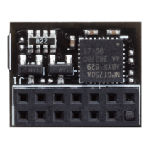
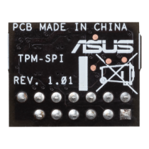
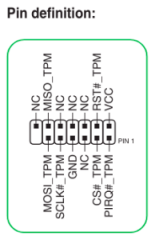
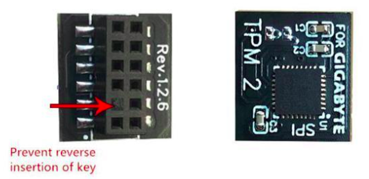
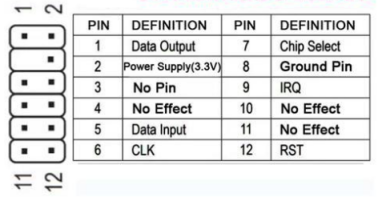
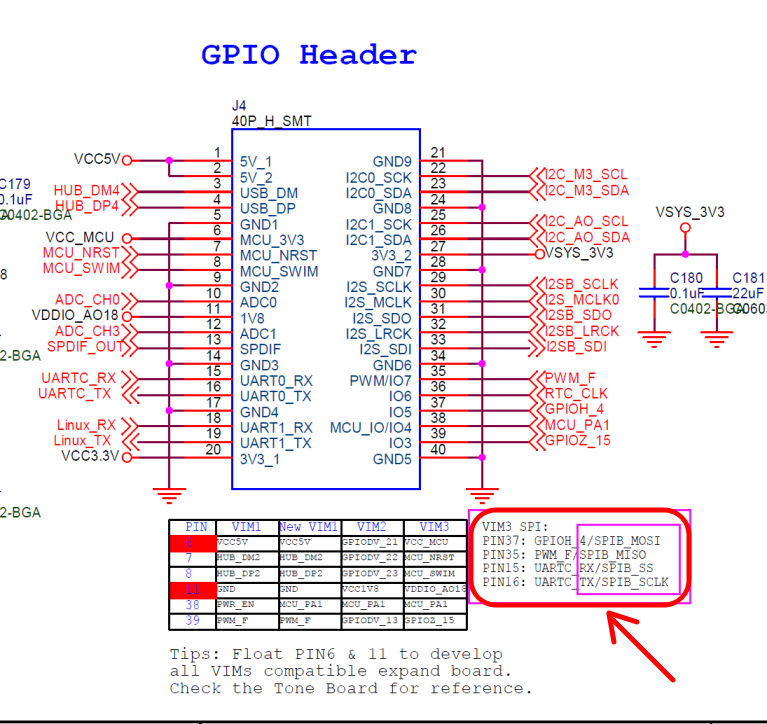
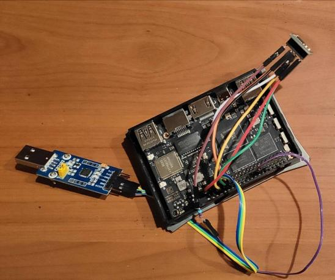

# kvim3TPM
Сonnecting and using the **TPM module** on Khadas VIM3 SBC

**Описание на русском см. ниже.**

Experiments with connecting the TPM module to [Khadas VIM3](https://www.khadas.com/vim3).

I have a task to use the TPM module on the VIM3.
The following TPM modules were purchased:

### [TPM-SPI 90MC07D0-M0XBN0 for ASUS](https://www.asus.com/motherboards-components/motherboards/accessories/tpm-spi/helpdesk_knowledge?model2Name=TPM-SPI), mcu: **Nuvoton NPCT750A**
  


### [GC-TPM2.0 SPI Gigabyte](https://www.gigabyte.ru/products/page/mb/GC-TPM20-SPI/sp), mcu: **Infineon SLB9670**

 


Both TPM modules have **SPI interface**.

The TPM module is connected to an external **40-pin GPIO header** VIM3:





I connected TPM module **Reset pin** to VIM3 VCC3.3v through a **10К resistor**.

## Presets:
 1. **Config and rebuild Linux kernel** - [kernel-config](https://docs.khadas.com/products/sbc/vim3/development/linux/build-linux-kernel):
```
make kernel-config
```
- release SPI1 -> spidev:
```
Device Drivers  ---> [*] SPI support  ---> <M> User mode SPI device driver support
```
- enable TPM:
```
Device Drivers  ---> Character devices  ---> <M> TPM Hardware Support  --->
   <M>   TPM Interface Specification 1.2 Interface / TPM 2.0 FIFO Interface  
   <M>   TPM Interface Specification 1.3 Interface / TPM 2.0 FIFO Interface - (SPI)
```
After this, we rebuild the kernel:
```
make kernel-deb
```
After this, from the fenix directory **build/images/debs/1.5.2/VIM3** from the deb package **linux-image-amlogic-mainline_1.5.2_arm64.deb** from boot directory we take the files: 
- config-6.2.0
- System.map-6.2.0 
- vmlinuz-6.2.0<br>

and copy them to **/boot/** on the SD card.  Moreover, we copy file **vmlinuz-6.2.0** twice: under the name **vmlinuz-6.2.0** and under the name **zImage**.
From the deb package **linux-image-amlogic-mainline_1.5.2_arm64.deb** from **lib/modules/6.2.0/kernel/drivers/char** directory we copy the directory **tpm** to /**rootfs/lib/modules/6.2.0/kernel/drivers/char** on the SD card.


2. **Device tree:**

There are two options: *2.1 - add a record directly to the device tree* or *2.2 - make an overlay*, which will add the necessary functionality on top of the device tree. See the second option below.

**2.1**<br>
2.1.1
- Get /boot/dtb.img (from SD card)
- decompile dtb (explanation [here](
https://forum.khadas.com/t/how-to-make-dts-work-without-building-the-whole-image/15370/4))
- add to dts somewhere near:
```
spi@15000 {
     compatible = "amlogic,meson-g12a-spicc";
```
this entry:
```
tpm_tis_spi:@0 {
     status = "okay";
     compatible = "infineon,slb9670", "tcg,tpm_tis_spi";
     reg = <0>;
     spi-max-frequency = <43000000>;
};
```
and reassemble dtb.

2.1.2<br>
In **/boot/env.txt** (on the SD card), add **spi1** to overlays and remove **uart3** and **pwm_f** (explanation [here](https://docs.khadas.com/products/sbc/vim3/applications/gpio/spi)).<br>

**2.2**<br>
2.2.1<br>
We add an overlay for the device tree with the following content to the kernel (**arch/arm64/boot/dts/amlogic/overlays/kvim3/tpm.dts**):
```
/dts-v1/;
/plugin/;

/ {
    fragment@0 {
        target = <&spicc1>;

        __overlay__ {
            spidev@0 {
                status = "disabled";
            };
        };
    };

    fragment@1 {
        target = <&spicc1>;

        __overlay__ {
            status = "okay";

            tpm_tis_spi:tpm@0 {
                status = "okay";
                compatible = "infineon,slb9670", "tcg,tpm_tis_spi";
                reg = <0>;
                spi-max-frequency = <43000000>;
            };
       };
   };
};
```
Here we disable the spidev device controlled by the spicc1 controller and enable a device of type tpm_tis_spi instead.
Also don’t forget to add our overlay to the list of files for build (**arch/arm64/boot/dts/amlogic/overlays/kvim3/Makefile**).

2.2.2<br>
We build the modules and dtb and upload them to the device (SD card). The file with overlay for tpm should be placed in the **/boot/dtb/amlogic/overlays/kvim3/** directory on the SD card.
In the **/boot/env.txt** file, add tpm to the overlay=... tpm list. Check after reboot.
2.2.3<br>
Also, don’t forget to add spi1 to /**boot/env.txt** in overlays and remove u**art3** and **pwm_f** (explanation [here](https://docs.khadas.com/products/sbc/vim3/applications/gpio/spi)).<br>


### To check TPM module,<br>
 in addition to **dmesg | grep -i tpm** and the presence of device files **/dev/tpm0**, you can use tests, for example, from the [wolfTPM package](https://github.com/wolfSSL/wolfTPM) or [ELTT2 package](https://github.com/Infineon/eltt2) (for Infineon SLB9670 TPM chip).

Example **wolfTPM** test output:
```
./wolfTPM/tests/unit.testTPM2: Caps 0x00000000, Did 0x0000, Vid 0x0000, Rid 0x 0
TPM2:
 Caps 0x00000000, Did 0x0000, Vid 0x0000, Rid 0x 0
Command
 size: 12
80
 01 00 00 00 0c 00 00 01 45 00 00 | .........E..
Response
 size: 10
80
 01 00 00 00 0a 00 00 00 00 | ..........
Test
 TPM Wrapper: Init: Passed
TPM2:
 Caps 0x00000000, Did 0x0000, Vid 0x0000, Rid 0x 0
.....
Test
 TPM Wrapper: Cleanup: Passed
Test
 TPM Wrapper: Thread Local Storage Passed
```
Example **ELTT2** test output:
```
./eltt2 -g
 
TPM capability information of fixed properties:
=========================================================
TPM_PT_FAMILY_INDICATOR:     2.0
TPM_PT_LEVEL:                0
TPM_PT_REVISION:             138
TPM_PT_DAY_OF_YEAR:          8
TPM_PT_YEAR:                 2018
TPM_PT_MANUFACTURER:         IFX
TPM_PT_VENDOR_STRING:        SLB9670
TPM_PT_VENDOR_TPM_TYPE:      0
TPM_PT_FIRMWARE_VERSION:     7.85.4555.0
 
TPM_PT_MEMORY:
=========================================================
Shared
 RAM:                     0 CLEAR
Shared
 NV:                      1 SET
Object
 Copied To Ram:           1 SET
 
TPM_PT_PERMANENT:
=========================================================
Owner
 Auth Set:                 0 CLEAR
Sendorsement
 Auth Set:                 0 CLEAR
Lockout
 Auth Set:                 0 CLEAR
Disable
 Clear:                    0 CLEAR
In
 Lockout:                  0 CLEAR
TPM
 Generated EPS:            0 CLEAR
```


### to be continued...

In the next parts we will see how to enable TPM in **u-boot** and how to use TPM module in Debian.